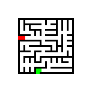
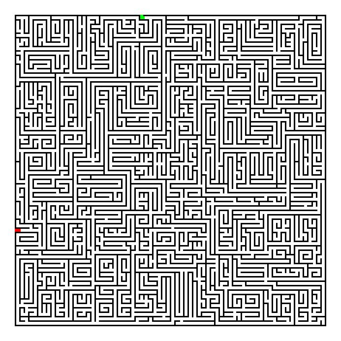

# MazeMaker
 A random maze-generator written in golang.

## Usage

`go run main.go *WIDTH* *HEIGHT* *OUTPUT FILE NAME*` 

## Examples
Command: go run main.go 10 10 small_maze  
Output image:  

Command: go run main.go 10 20 small_rectangle_maze  
Output image:  

Command: go run main.go 20 30 medium_rectangle_maze  
Output image:  

Command: go run main.go 70 70 large_maze  
Output image:  

Command: go run main.go 100 100 huge_maze  
Output image:  

## The Algorithm
The algorithm works by choosing a direction to draw a line in, and then drawing a line in that direction. It has a minimum amount of lines it has to draw for the "Solution". When the solution is drawn, the algorithm chooses one of the "cells" that has already been drawn in. It then draws a line from that cell, and continues this process until all cells have been drawn in.
